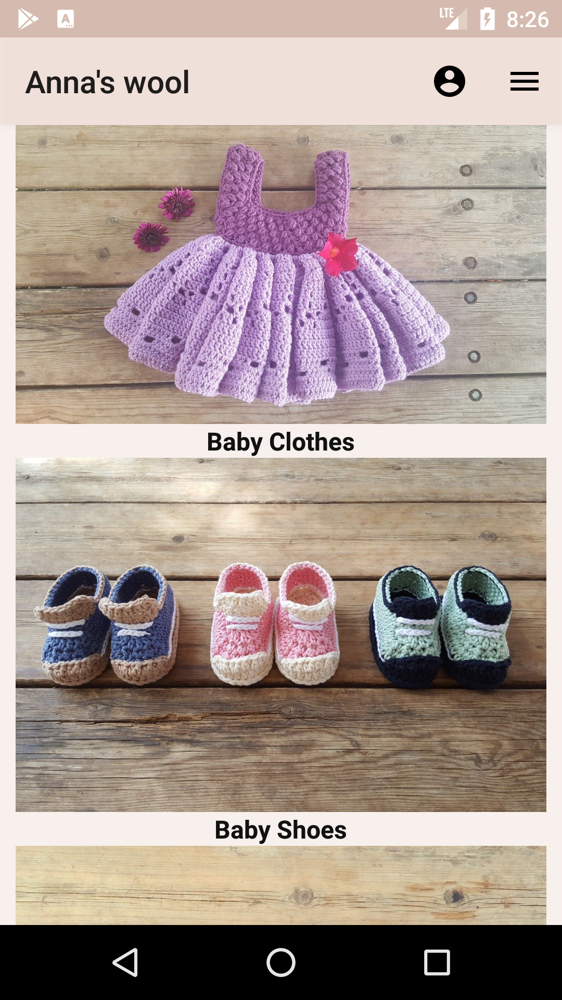
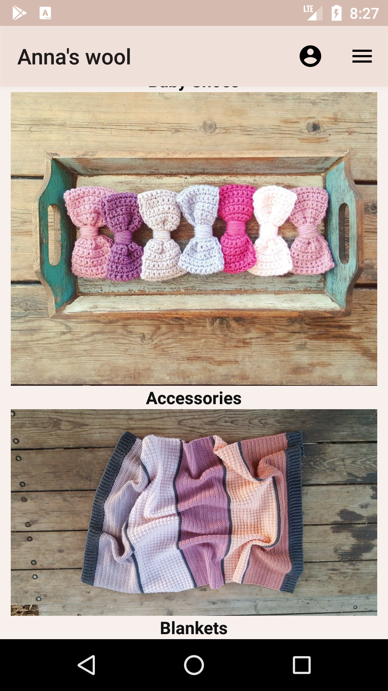
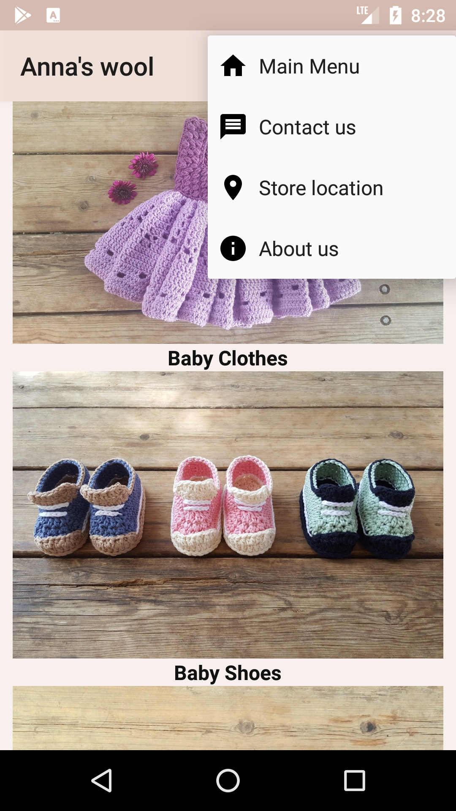

# Anna's Wool
This app simulates a clothing store app. 

# Main Menu
The app main menu is built from different categories of clothing / accessories. every click at any option will pass to the next activity depending on the selected category. 

   

In addition to clicking on a category, you can also click on the Toolbar which contains many other options such as communicating with the app owner, the physical location of the store, and more.

The Tooblar also conatains option to enter the personal area of the site users, by clicking on the user image on top you'll be taken to the next page depending on your status on the site.

# User Conection
