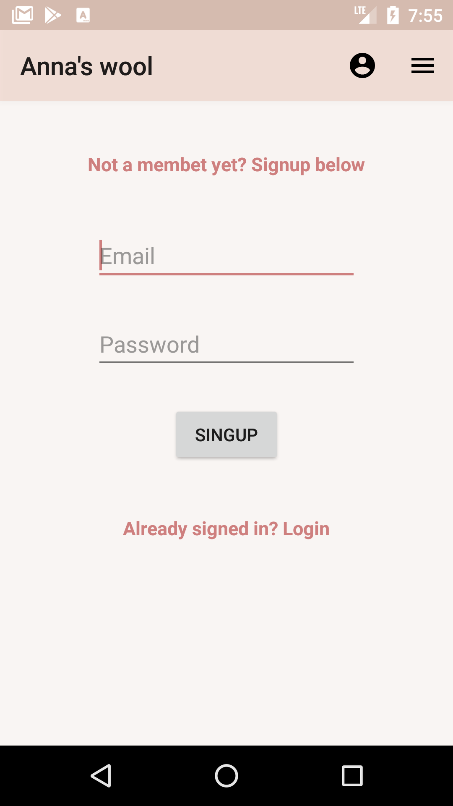
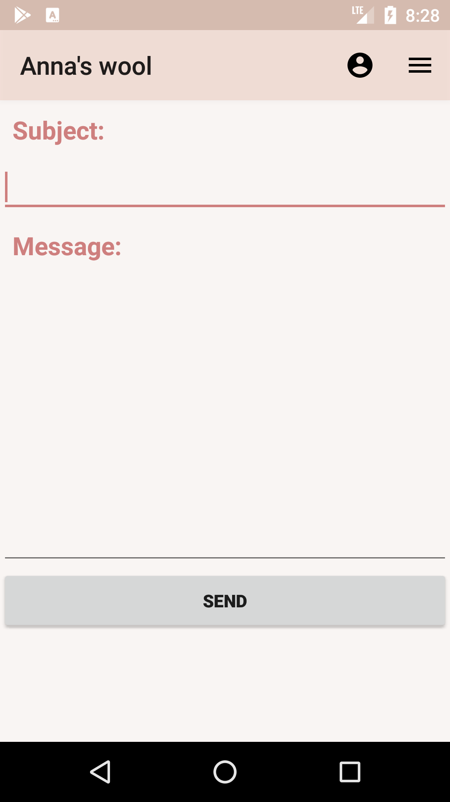
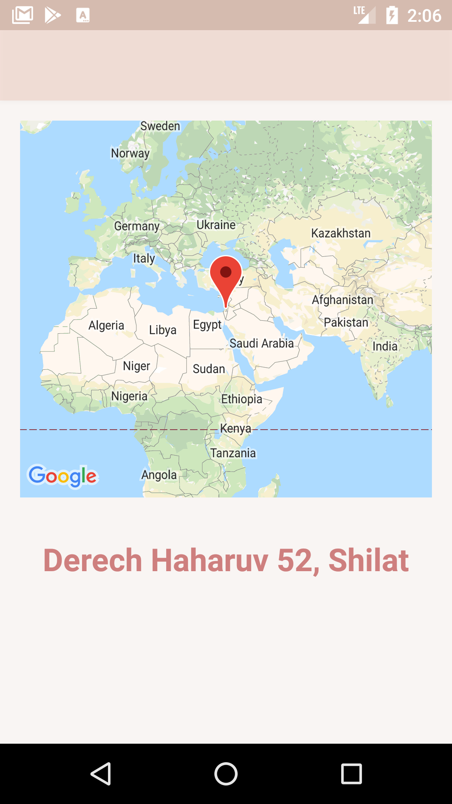

# Anna's Wool
App provides a platform for buying hand made wool clothes
from my sister Anna Ostrovski, hence the name :)

# Main Menu
The app main menu is built from different categories of clothing / accessories. every click at any option will pass to the next activity depending on the selected category. 

      

After you clicked on a category, for example Baby Clothing you will pass to a new activity containing recyclerview of the baby clothes which include picture of the product and the product name.The items in this activity are all clickable and clicking on them will send you to a third activity.

 

In this page you can see the product details, some you could see in the activity before but there are new details like the price of the product and the option to Like a product, you can only use the Like button if you are connected to the user account (explained below).

In addition to clicking on a category, you can also click on the Toolbar which contains many other options such as communicating with the app owner, the physical location of the store, and more.

The Tooblar also contains an option to enter the personal user area, by clicking on the user image on top you'll be taken to the next page depending on your user status on the site.

# User Connection
As indicated above the page which will appear depending on your status on the site, if youre not connected to your user the Login page will appear, enter your password and e-mail and connect to your user. In case you forgot your password you can always click on "Forgot Password" and an email will be sent to you. If youre a new member at the shop youre welcome to click on the "Not a member?Register" text in order to join our shop community, by clicking on this text you'll be taken to the Register page. 

In order to register to the app just enter your email and a password, click signup and you are part of the Anna's Wool community.

If youre already connected to your user the page that will apear will be the user page. 

# Contact Us
In this category you can send a message to the business owner by email. This category is designed in a user-friendly way. You just need to enter your subject and the content itself, the app should be synced to your email. The app will give you the option to send the email with the help of Gmail.

# Store Location
In this category a Google map showing the address of the business is displayed, in addition to the full address of the business.

